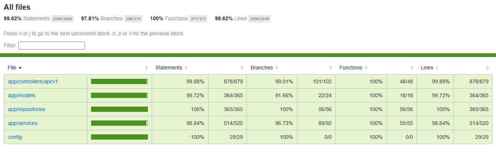

# TakeOff Backend API

Restful API for takeoff, flight application for web and android. this is part of  fullstack web developmen course final project. 

## Live Application

This application is currently deployed using [railway.app](railway.app).  
You can access this application on [https://beckend-takeoff-production-46fc.up.railway.app/](https://beckend-takeoff-production-46fc.up.railway.app)  
  
Information about server routes and documentation can be seen [here](#routes-and-documentation).

## Running Local App

to run this app in local folllow this instruction

### Setup Local Server and Database

    npm install / yarn install

After that, run this command to setup database with sequelize. Remember to setup `.env` file on this project first with your postgres database, cloudinary.

### Running Server

    npm run start / yarn start

run this command to start express server normally. To run the server in development mode, use this command instead:

    npm run develop / yarn develop

To run unit tests, use this command:

    npm test / yarn test

## Routes, Documentation, and Test Coverage

### Routes and Documentation

Open API Documentation:

[https://beckend-takeoff-production-46fc.up.railway.app/api-docs](https://beckend-takeoff-production-46fc.up.railway.app/api-docs)

Default admin account

    {
      email: 'admin2@mail.com',
      password: 'Admin123!',
    }

### Test Coverage

